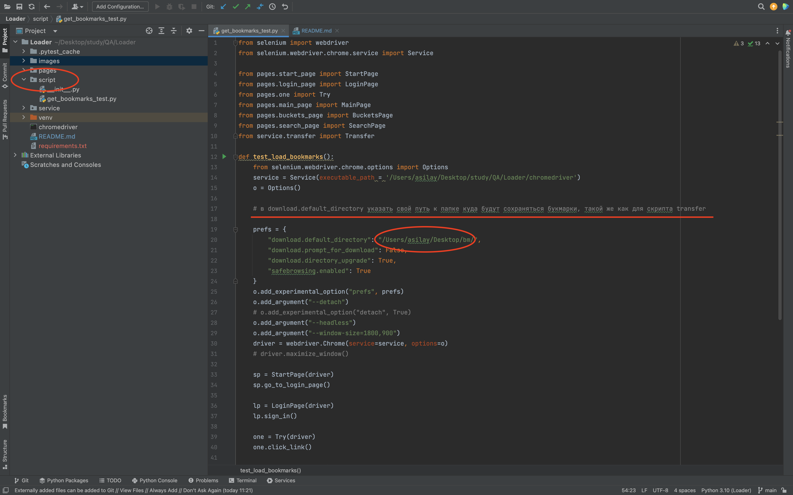
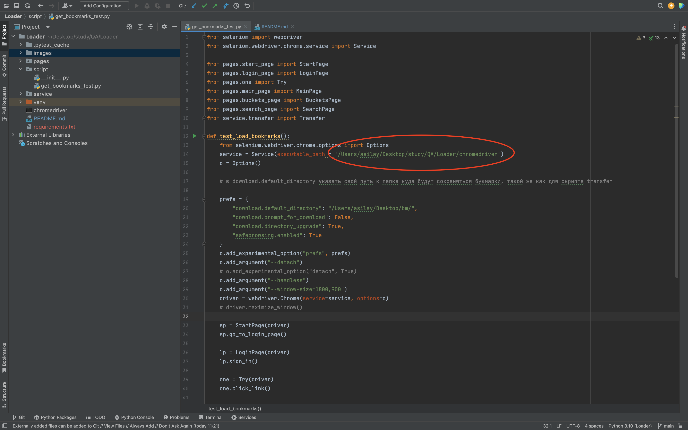
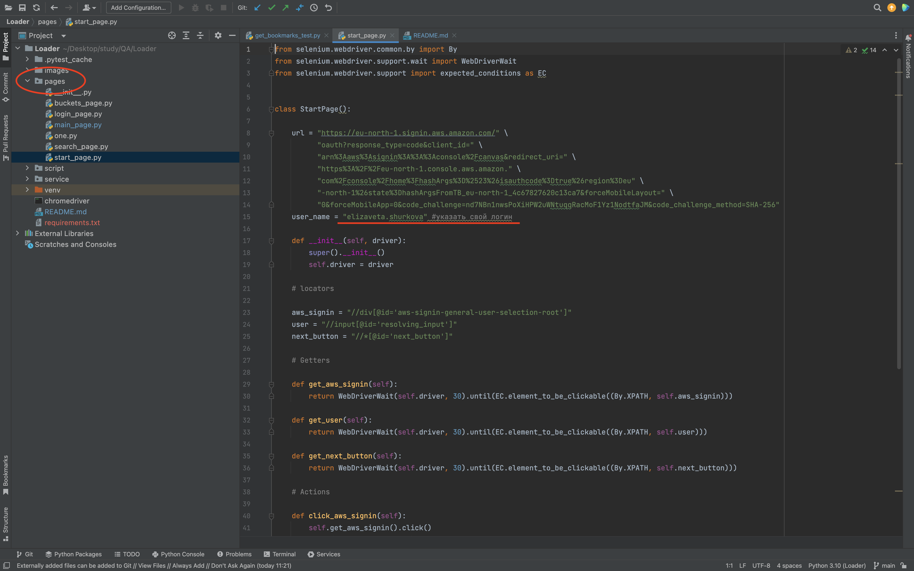
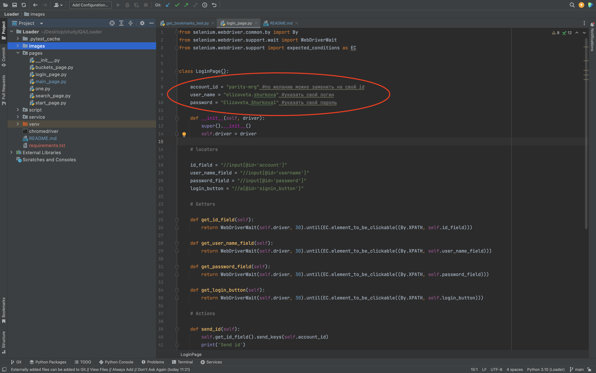
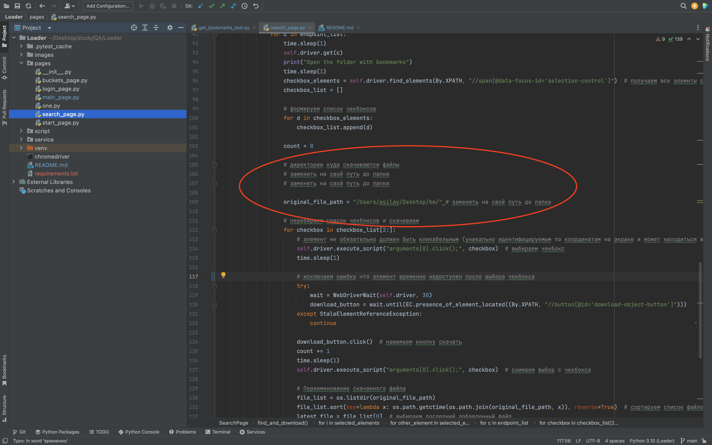
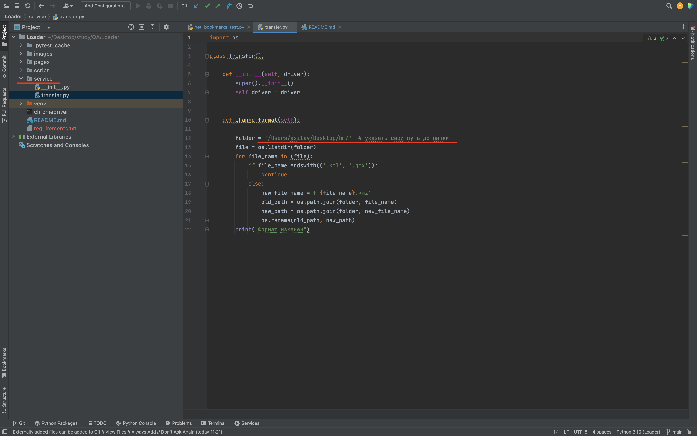
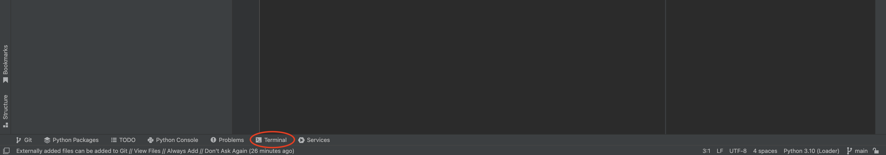
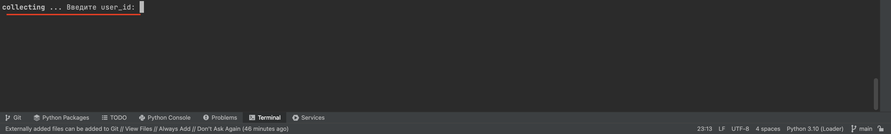
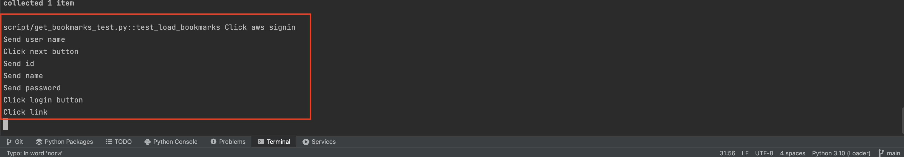
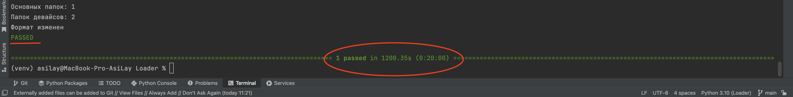

### После открытия проекта в pycharm
1. открыть папку в проекте (выделено слева) в открывшемся списке двойным кликом открыть файл get_bookmarks_test 

_и изменить путь к созданной папке, куда будет происходить сохранение файлов при отработке скрипта (по центру)_

_Чтобы посмотреть путь к файлу на Windows, нужно выполнить следующие шаги:_

1. Найти где хранится нужный файл/папка.
3. Нажмите правой кнопкой мыши на файл например - хромдрайвера и выберите "Свойства" в контекстном меню.
4. В открывшемся окне "Свойства" перейдите на вкладку "Общие".
5. В разделе "Расположение" будет указан путь к файлу.

_Скопировать путь, который будет выглядеть примерно так: C:\путь_к_файлу\chromedriver.exe. Затем вставить этот путь в код Python, выделенный на скрине 1, 2, 5, 6_
2. изменить путь для хромдрайвера (выделено)

3. открыть папку (выделено слева) в открывшемся списке открыть файл start_page

_и заменить значение в кавычках на ваш логин из кред облачного хранилища букмарок (в центре скрина)_

4. открыть файл login_page

_и изменить значения (выделены в центре) на свои_

5. открыть файл search_page

_найти блок выделенный на скрине и указать путь до папки куда будут сохраняться файлы в ходе работы скрипта (инструкция из телеграм)_

6. открыть паку service, в списке открыть файл transfer

_и в нем изменить значения (выделены в центре) на свой путь до папки куда будут сохраняться файлы в ходе работы_

### После предварительных настроек
1. открыть терминал в pycharm:

2. ввести команду:
> python3 -m venv venv
3. ввести команду:

на мак:

> source venv/bin/activate

на винде:
> venv\Scripts\activate.bat

4. ввести команду для установки расширений:

> pip install -r requirements.txt

### После установки расширений
1. в терминал pycharm ввести команду:
> pytest -sv

2. в логах терминала появится сообщение:

_в эту строку вводим user_id из БД для которого необходимо скачать букмарки_

_если все было установлено корректно - отобразятся логи работы скрипта_

_после того как скрипт зевершит работу_

3. открыть папку указанную созданную для сохранения букмарок.